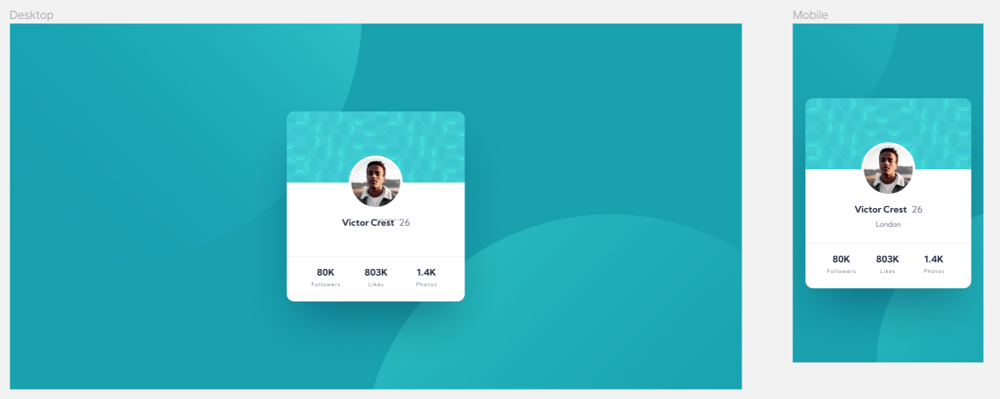
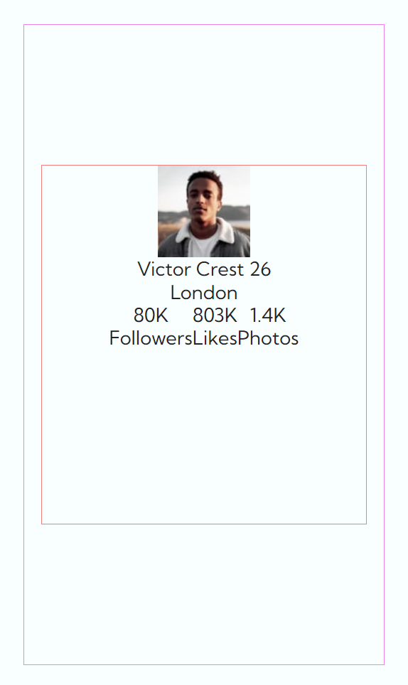
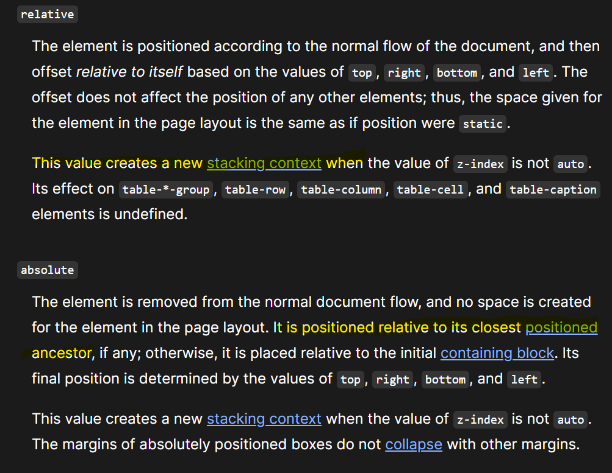
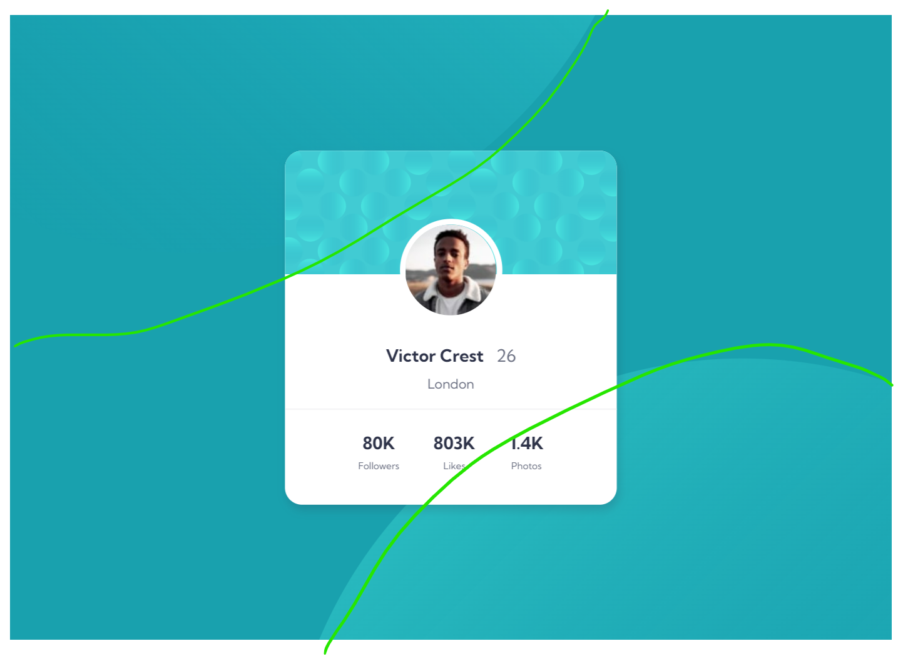

# Frontend Mentor - Profile card component solution

This is my solution to the [Profile card component challenge on Frontend Mentor](https://www.frontendmentor.io/challenges/profile-card-component-cfArpWshJ). Frontend Mentor challenges help you improve your coding skills by building realistic projects. 

## Table of contents

- [Overview](#overview)
  - [The challenge](#the-challenge)
  - [Screenshot](#screenshot)
  - [Links](#links)
- [My process](#my-process)
  - [Built with](#built-with)
  - [What I learned](#what-i-learned)
  - [Continued development](#continued-development)
  - [Useful resources](#useful-resources)
- [Author](#author)

**Note: Delete this note and update the table of contents based on what sections you keep.**

## Overview

### The challenge

Build out the project to the designs provided - pretty simple right?!? 🤣  _There's always a gotcha in there somewhere._ 😄

### Screenshot

Here is the Figma design:

And my solution:

### Links

- [Solution on Github](https://github.com/JoleneKearse/fem-profile-card-component)
- [Live Site URL](https://fem-profile-card-component-rho.vercel.app/)

## My process

As usual I designed this *mobile-first*, although there really weren't too many differences between screen sizes. 🤣

I did attempt a _more professional workflow_ by adhering to *good commits*. So trying to label them correctly, and only doing one thing per commit. 😱

Usually I like to start by styling the *typography*, but found it made more sense to start with the *layout* here.

This gave me a much better idea of both the container and card space I was working with! 😃

### Built with

- Semantic HTML5 markup
- CSS custom properties
- CSS Grid
- Flexbox
- Mobile-first workflow
- Positioning

### What I learned

Basically, my **biggest win** was not being so wary of using `position: relative` and `position: absolute`! I usually only use these as a last resort, but I had planned to use it for the background images right from the start. 

I had to Google which value to use on the parent again, but reading the **MDN docs** helped:

Now on to my **biggest headache**...

Figuring out 'just how the H***' to position those really cool circles in the background!

I first tried my hardest to use the `top`, `right`, `left`, and `bottom` properties open once you use `position`, but no dice! 🎲 😠 I played around with that and `width` and `height` for awhile, getting _interesting_ cut off circles...  Then there was that bit I had to check if I had mistakenly placed it in `div class="card"`, because I couldn't get them out of the middle of the page.  🤯

But I found using the `background` properties were what really helped me out.  Through quite a lot of trial and error, `background-position` came in for the win! 🏆

### Continued development

I will continue working on **only doing one change per commit**. I will; promise! 🤞 I changed from simply typing `git add .` to adding the actual files and quite liked it, but still find myself jumping from file to file and forgetting to commit. 🤣  _Oh well, baby steps!_

### Useful resources

- [MDN: `position`](https://developer.mozilla.org/en-US/docs/Web/CSS/position) - This helped me remember the differences between the `relative` and `absolute` values.
- [MDN: `background-position`](https://developer.mozilla.org/en-US/docs/Web/CSS/position) - This is helped me finally set the circle svgs correctly!

## Author

Hiya! 👋 My name is **Jolene Kearse**.  

I was an **English as a Foreign Language Teacher** ️🌏🧑‍🏫 for over 15 years - so, yeah, _for a little bit_ 🤌...  I lived all over the world, including China, England & South Korea.

Now I'm an awesome **Software Engineer**! 💃 I'm a **proud, self-taught individual**. 

I'm also proud of how far I came in 2022.  I finally learned **JavaScript**! 🍻 _I had struggled for about a year before I finally could add that to my skillset.  If you're interested in an awesome 🔥 course check out **[Class Central's Bootcamp YouTube Playlist going through freeCodeCamp's Algorithms and Data Structures Certification](https://www.youtube.com/playlist?list=PLU3RKvMpgrSEoqVIV14K_zuinrIBcnCgT).**

Then I met an awesome group of fellow-learning devs, **The Explorers**.  This exposed me to the myriad and oft-confusing ways of using **Git** in a team - loving it now!  But also projects using so many kinds of tech that would've just blown my mind a year before 🤯 including:
- React
- TypeScript
- Tailwind

I even participated in **[#Hacktoberfest](https://hacktoberfest.com/)** and earned the coveted T-shirt! 🎉👕

In *2023* I've been boning up on **React**, and just taking so many courses to learn **Backend Development** and **navigate the process of earning my first tech job**!

One of those courses has seen me going back to **Python** - which I had treated as my _crutch language_ to understand JavaScript.  🤣  But I've been loving navigating in multiple languages.

Another challenge I am undertaking this year is [Exercism's](https://exercism.org/) **#12in23**.  This is a cool 😎 opportunity to _try out_ 12 different languages this year.  Each month has a theme, like **Functional February** and **Mechanical March** to encourage you to check out different language paradims.  I'm loving this chance to dip my toe in other types of programming.  I find I'm gaining the ability to evaluate various languages' strengths and project needs.

Let's connect! 💬

- Frontend Mentor - [Jolene Kearse](https://www.frontendmentor.io/profile/JoleneKearse)
- LinkedIn - [Jolene Kearse](https://www.linkedin.com/in/jolene-kearse-2562ba218/)
- Twitter - [JoleneFromCanada](https://twitter.com/FromJolene)

